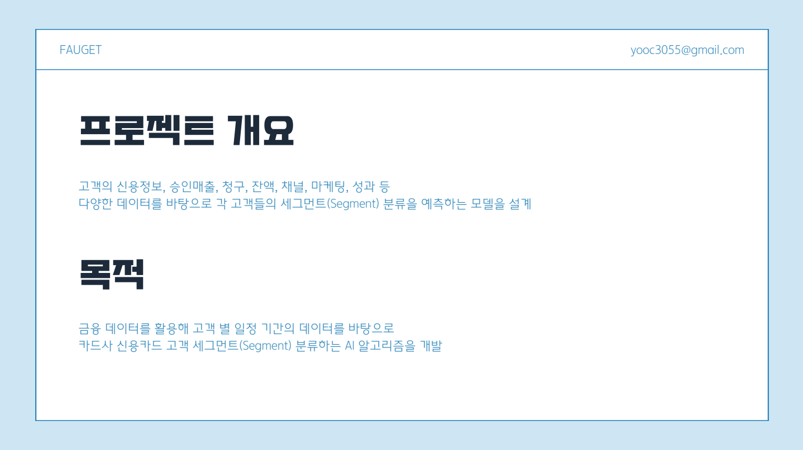
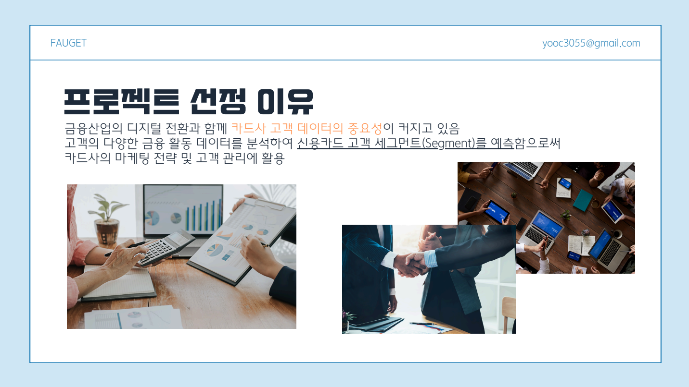
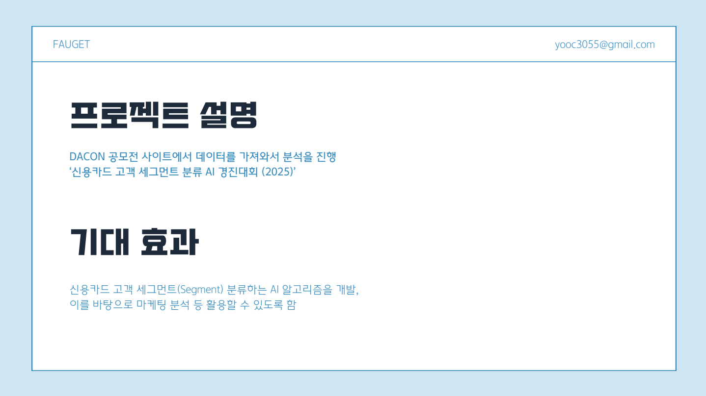
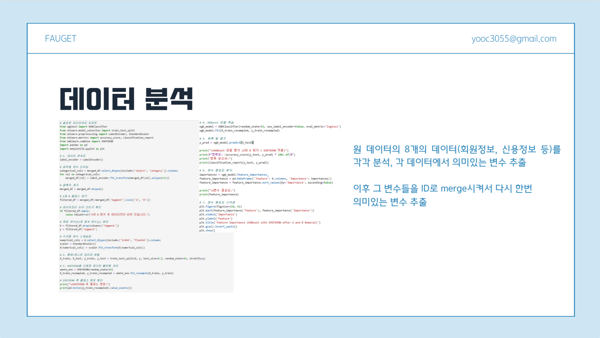
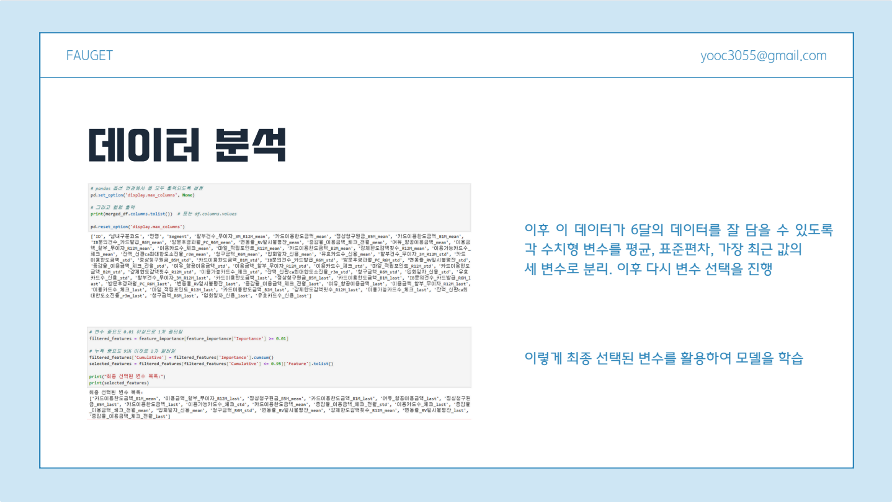
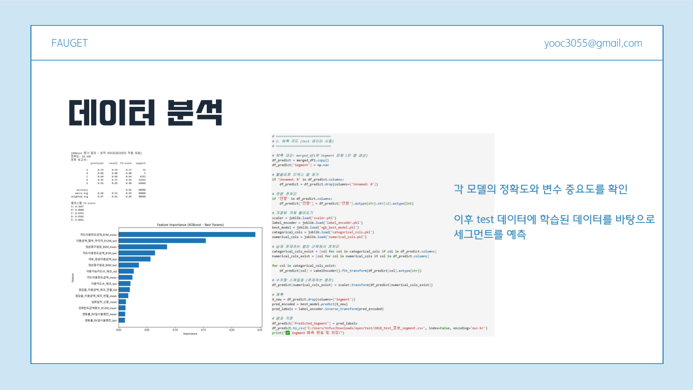
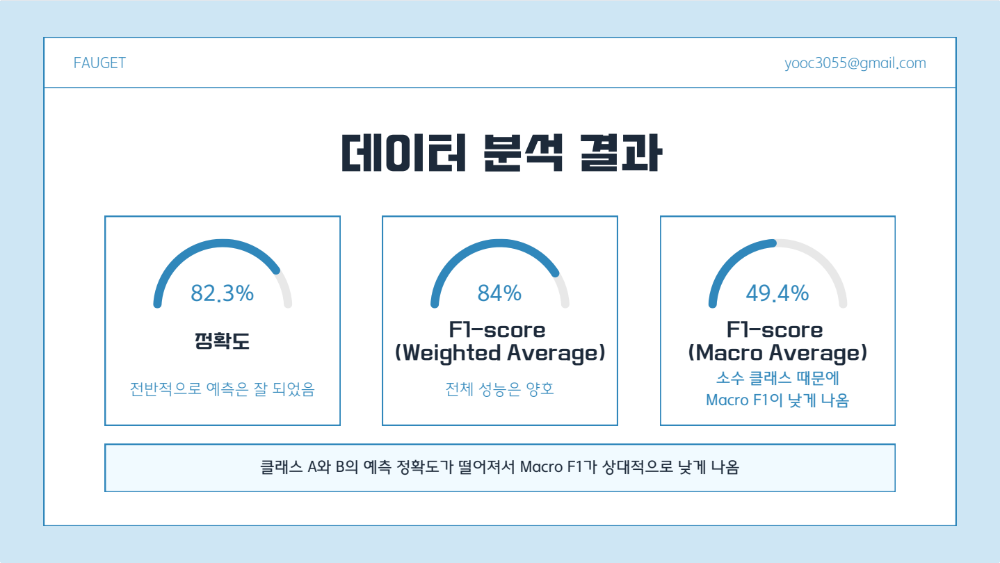
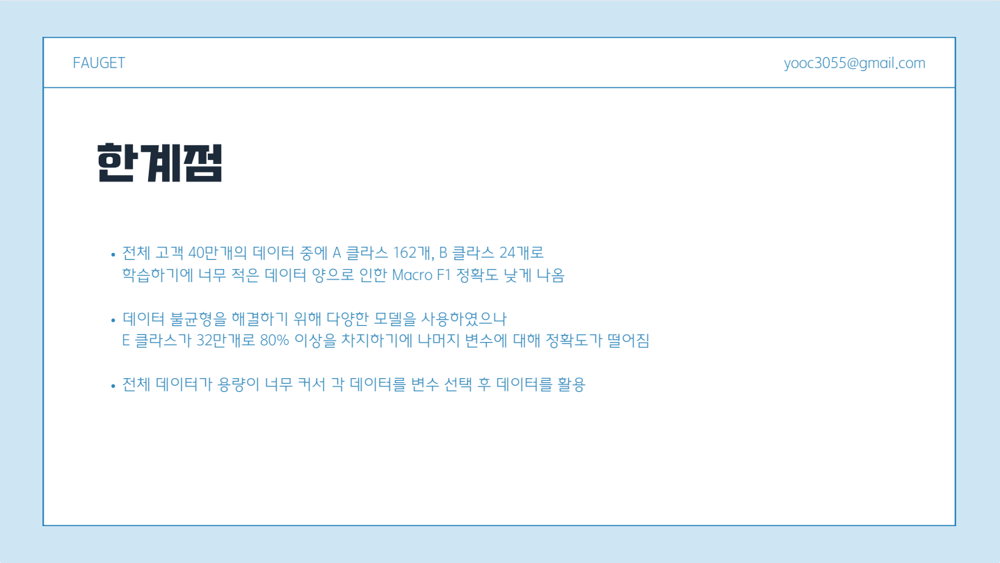

# 📊 신용카드 고객 세그먼트 분석 (2025 공모전)

이 프로젝트는 2025년 신용카드사 공모전을 위한 분석으로, 고객의 과거 6개월간 거래 정보를 기반으로  
고객을 A~E 세그먼트로 분류하는 머신러닝 모델을 개발하는 것이 목표입니다.  

이를 통해 마케팅 타겟팅, 리스크 관리, 고객 맞춤형 혜택 설계 등에서 활용 가능한 인사이트를 도출하고자 했습니다.

---

## 📊 프로젝트 개요

- **데이터**: 고객의 월별 카드 이용, 청구, 컨택, 이자율 등 총 6개월간의 금융 정보
- **모집단 규모**: 약 40만 명의 고객 데이터
- **목표**: 고객의 세그먼트 (A~E)를 예측하는 분류 모델 개발
- **기법**: XGBoost 기반 분류 모델 + SMOTEENN을 통한 클래스 불균형 해결
- **사용 언어 및 라이브러리**: Python, pandas, scikit-learn, imbalanced-learn, xgboost 등

---

## 💡 프로젝트 선정 이유

카드사는 고객 데이터를 가장 풍부하게 보유한 금융기관 중 하나로,  
정교한 고객 세분화는 마케팅 효율성과 리스크 관리에 결정적입니다.  
이번 공모전은 이를 위한 **실전형 분류 모델을 직접 설계하고 평가**할 수 있는 기회라 판단했습니다.

---

## 📘 프로젝트 설명

- **데이터 전처리**  
  결측치 제거, 이상값 처리, ID 단위 집계, 수치형/범주형 변수 정제  
- **6개월간의 데이터를 하나의 고객 요약 row로 구성**  
  → 평균, 표준편차, 마지막 달 값을 모두 포함해 고객의 '패턴'까지 반영  
- **클래스 불균형 처리**  
  Segment A, B는 극단적으로 적은 수를 가지므로 **SMOTEENN**을 활용하여 오버샘플링 및 노이즈 제거를 동시에 진행

---

## 📈 데이터 분석 과정
  
  

EDA, 변수 중요도 분석, 모델 성능 비교 등의 분석 과정을 통해  
고객의 세그먼트를 잘 구분하는 주요 변수들을 도출했습니다.

---

## ✅ 분석 결과

- **모델 성능**  
  - Weighted F1-score: **0.84**
  - Macro F1-score: **0.49**
- **클래스별 성능**
  - Segment E (대다수 고객군): f1-score ≈ 0.90
  - Segment A, B: 매우 적은 샘플로 인해 성능 낮음 (보완 필요)
- **변수 중요도**  
  카드 한도 정보, 이용금액 변화율, 컨택 빈도, 청구/이용 내역이 핵심 변수로 확인됨

---

## ⚠️ 한계점 및 보완 방향

- **클래스 불균형**: Segment B는 전체의 0.001% 수준으로, 분류 성능이 매우 낮음
- **시간적 정보의 손실**: 6개월을 평균/표준편차로 요약함으로써 '트렌드 정보'가 일부 손실됨
- **고객 세그먼트 기준의 불명확성**: 라벨링 기준이 불명확하여 모델 성능 평가에 제약 있음

> 📌 **향후 개선 방향**
> - LSTM 기반 시계열 분류 모델 적용
> - Segment B 대상 이진 분류기 따로 구성 (One-vs-Rest 방식)
> - SHAP 값을 활용한 예측 인사이트 설명 강화

---

🔗 본 프로젝트는 데이터 전처리, 분류 모델링, 성능 평가의 전 과정을 포함한 **신용카드 고객 세그먼트 분류의 완전한 파이프라인 예시**로 활용될 수 있습니다.
