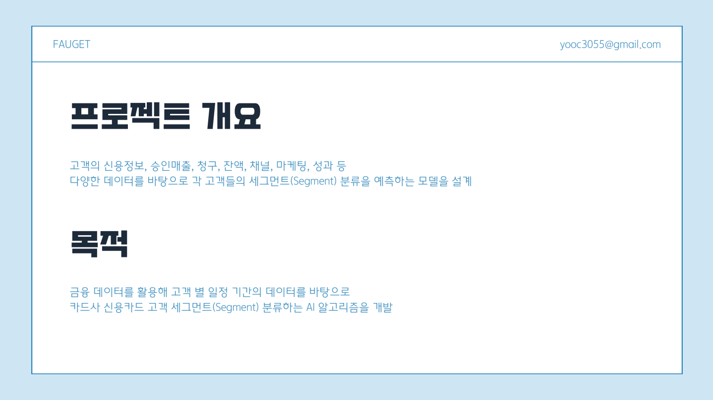
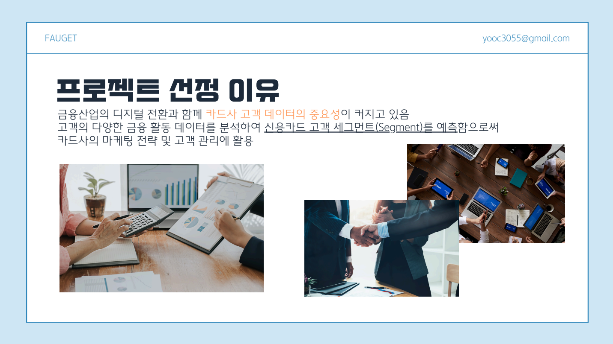
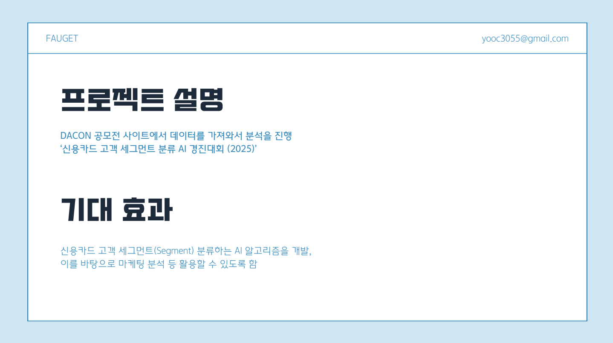
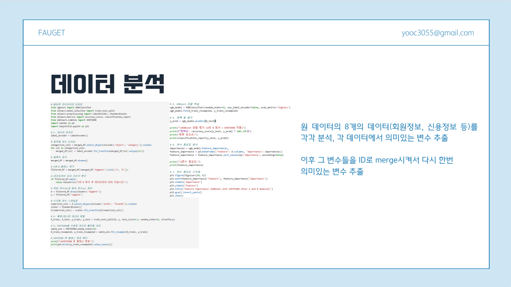
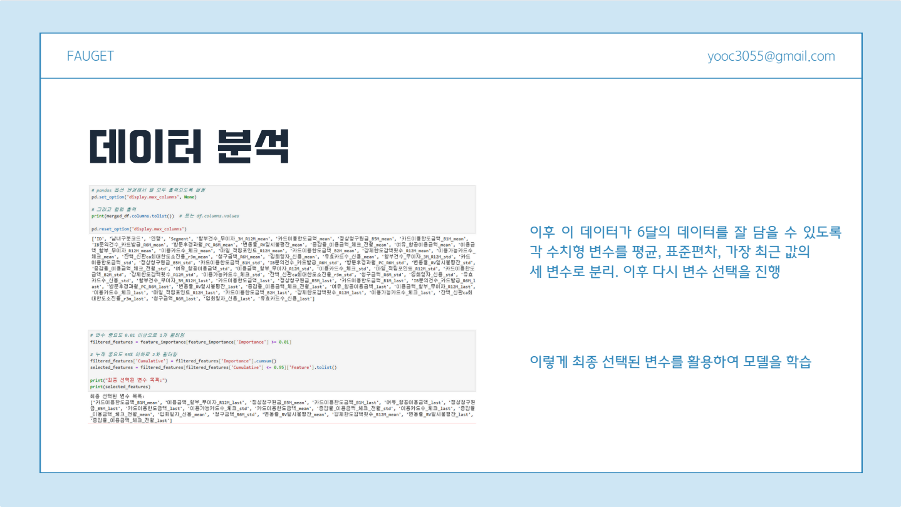
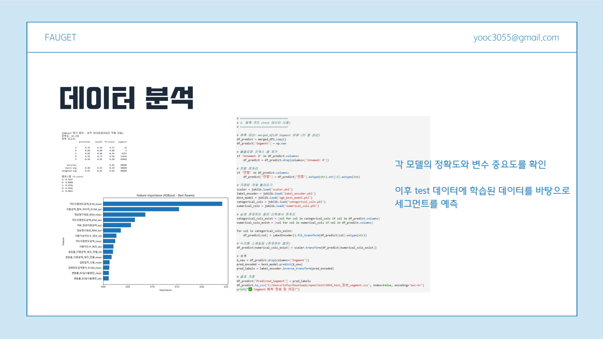
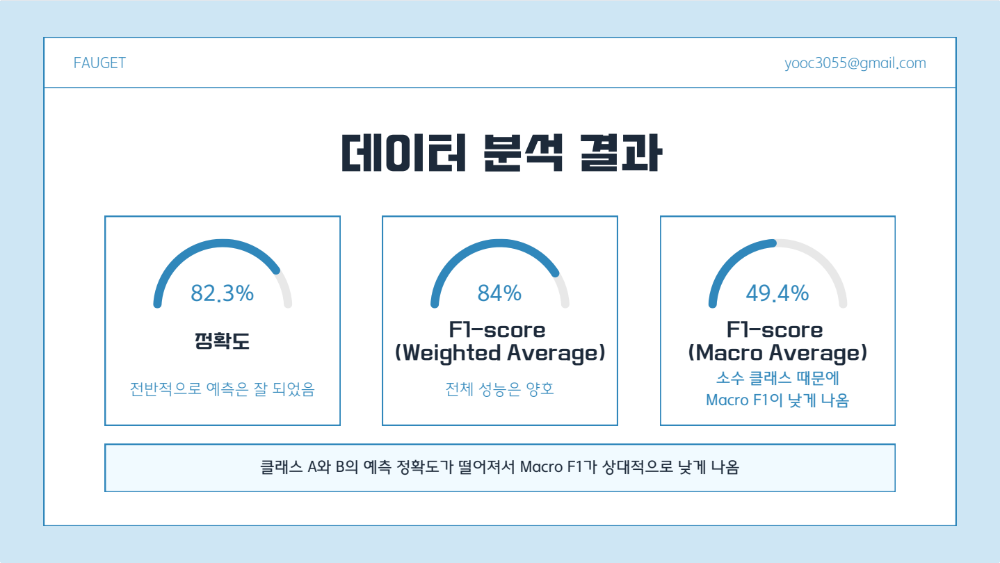

"# Credit Segment Analysis (2025)" 

# 📊 신용카드 고객 세그먼트 분석 (2025 공모전)

이 프로젝트는 2025년 신용카드사 공모전을 위한 분석으로, 고객의 과거 6개월간 거래 정보를 기반으로  
고객을 A~E 세그먼트로 분류하는 머신러닝 모델을 개발하는 것이 목표입니다.

<<<<<<< HEAD
---

[프로젝트 개요](https://drive.google.com/uc?export=view&id=1UlPWkrZsIfwyToU4GiQ0x9mADv0_2xFY)
=======

## 🗂 연습 프로젝트 개요

>>>>>>> b9c7292 (Add 프로젝트 이미지 및 README 구성)

## 📌 프로젝트 개요

- **데이터**: 고객의 월별 카드 이용, 청구, 컨택, 이자율 등 총 6개월간의 금융 정보
- **목표**: 고객의 세그먼트 (A~E)를 예측하는 분류 모델 개발
- **기법**: XGBoost 기반 분류 모델 + SMOTEENN을 통한 클래스 불균형 해결

<<<<<<< HEAD
---

## 📈 주요 결과

| 세그먼트 | F1-score |
|----------|----------|
| A        | 0.3667   |
| B        | 0.0000   |
| C        | 0.6391   |
| D        | 0.5582   |
| E        | 0.9041   |

- **Weighted F1-score**: 0.84
- **Accuracy**: 82.33%

---

## 🛠 사용 기술 스택

- Python 3.10+
- pandas, numpy, scikit-learn
- XGBoost
- imbalanced-learn (SMOTEENN)
- matplotlib, seaborn (시각화)

---

## 🧪 모델 학습 방식

- 결측치 제거 후 수치형/범주형 변수 전처리
- `StandardScaler`로 수치형 정규화
- `SMOTEENN`으로 학습 데이터 오버샘플링 & 노이즈 제거
- 하이퍼파라미터 튜닝 (GridSearch)
  - `max_depth=6`, `n_estimators=200`, `learning_rate=0.2`, `subsample=0.8`

---

## 🗂 폴더 구조

credit-segment-analysis/ ├── README.md ├── requirements.txt ├── notebooks/ │ └── main_analysis.ipynb ├── scripts/ │ └── predict.py ├── models/ │ └── xgb_best_model.pkl ├── results/ │ └── summary.csv └── .gitignore

=======

## 💡 연습 프로젝트 선정 이유

---

## 🧪 연습 프로젝트 설명

---

## 📊 데이터 분석 과정

### 1단계

### 2단계

### 3단계

---

## ✅ 분석 결과

---

## ⚠️ 한계점 및 보완 방향

>>>>>>> b9c7292 (Add 프로젝트 이미지 및 README 구성)
